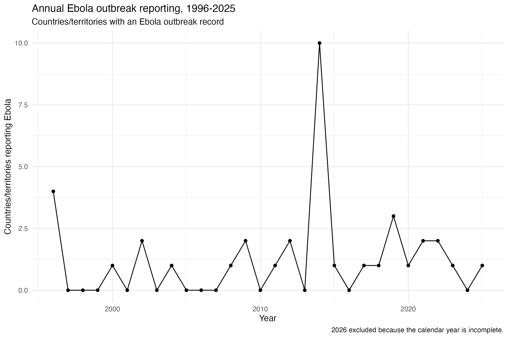
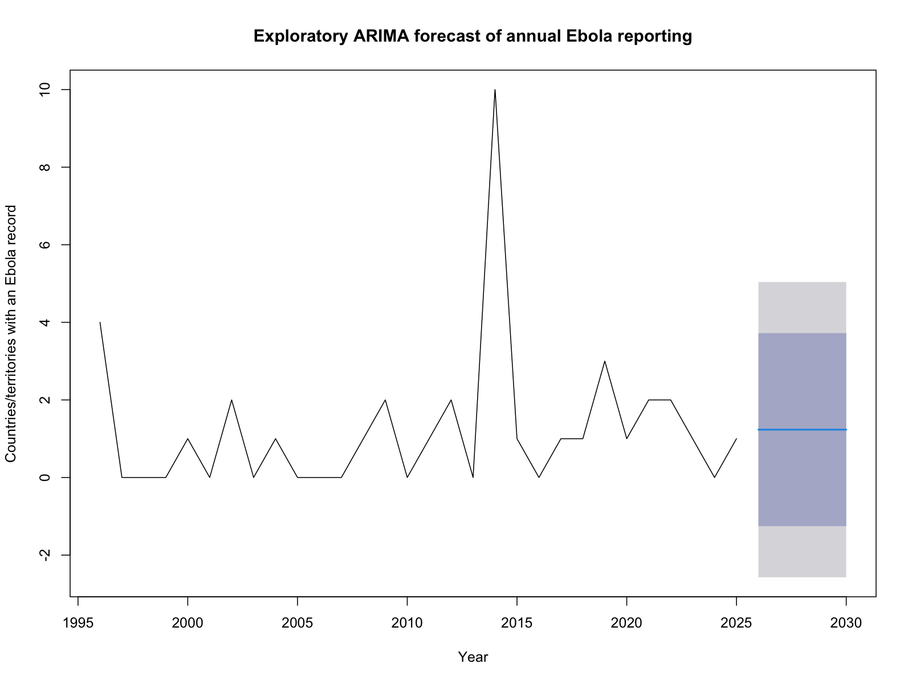
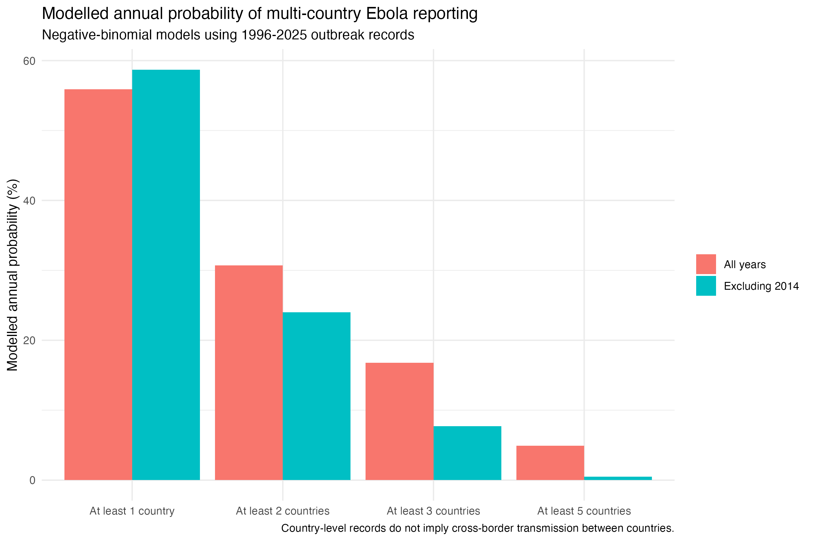
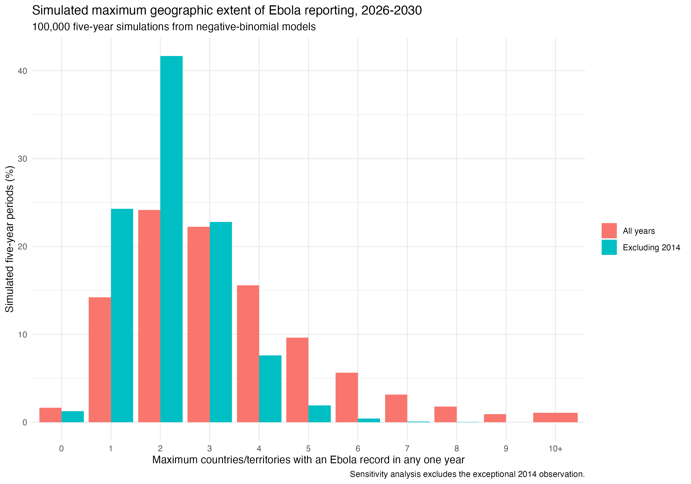
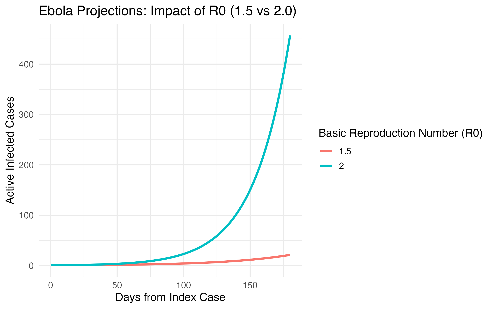
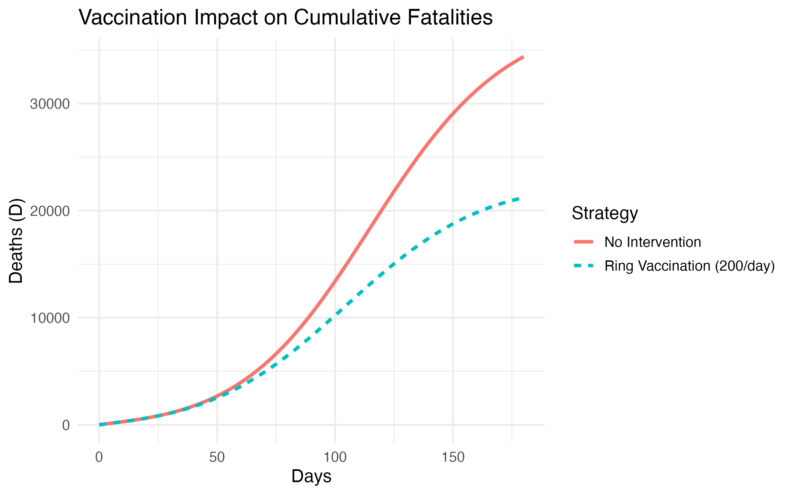
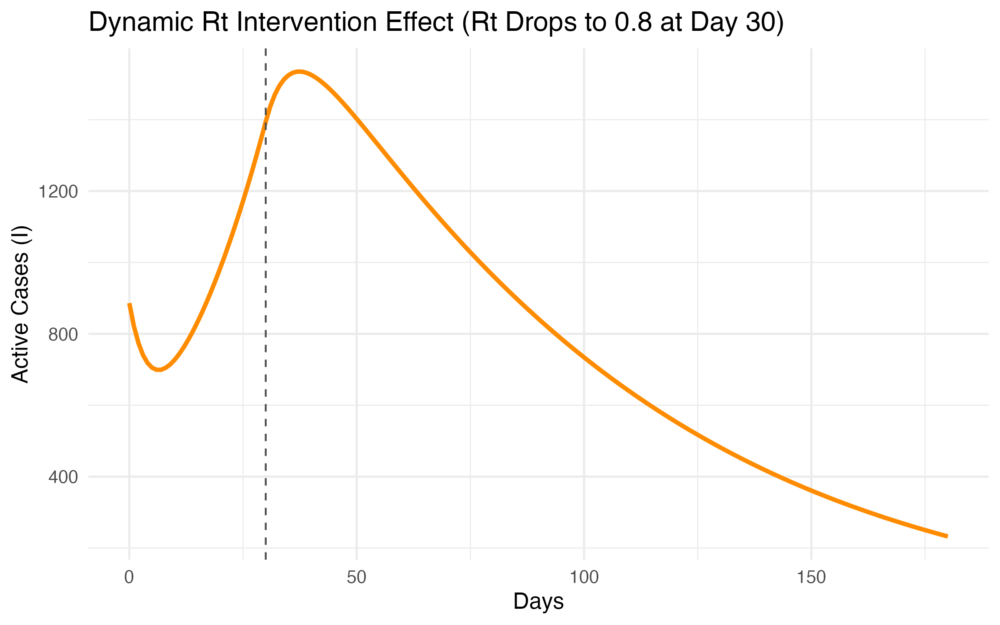

# Ebola Outbreak Reporting: Forecasting, Simulation and Mechanistic Modelling

A reproducible exploratory analysis of annual Ebola outbreak reporting from 1996–2025, combining time-series analysis, count regression, Monte Carlo simulation and theoretical compartmental epidemic modelling.

Primary objectives:

1. What can historical outbreak surveillance data tell us about future patterns of multi-country Ebola reporting?
2. How might epidemic trajectories differ under hypothetical transmission and intervention scenarios?

These questions are addressed separately because the first is is achieved via data-driven statistical modelling and the second uses mechanistic SEIR-based scenarios with assumed parameters.  

> Important: the surveillance analysis models the number of countries or territories with an Ebola outbreak record in a calendar year. It does not forecast individual Ebola cases or estimate transmission between countries.

---

## Analysis overview

```text
Historical Ebola outbreak records
            ↓
Annual country-level time series
            ↓
Exploratory ARIMA modelling
            ↓
Poisson vs negative-binomial modelling
            ↓
Annual multi-country reporting probabilities
            ↓
2014 sensitivity analysis
            ↓
100,000 simulations of 2026–2030
            ↓
Maximum geographic extent analysis

                    +

Theoretical mechanistic extension
            ↓
SEIR transmission scenarios
            ↓
R = 1.5 vs R = 2.0
            ↓
Vaccination scenario
            ↓
Dynamic transmission-control scenario
```

---

# Research questions

1. What has annual Ebola outbreak reporting looked like since 1996?
2. Is there detectable temporal structure in the annual series?
3. Is ARIMA an appropriate forecasting framework for these data?
4. Does a Poisson or negative-binomial model better represent annual Ebola reporting?
5. What is the modelled probability of Ebola being reported in multiple countries within a year?
6. How influential is the 2014 Ebola epidemic in our modelling results?
7. Under the historical reporting distribution, what might hypothetical five-year periods from 2026–2030 look like?
8. How geographically extensive might the largest reporting year be within those simulations?
9. How does assumed transmission intensity alter epidemic growth?
10. How might vaccination or a reduction in transmission alter epidemic trajectories under a simplified compartmental model?

---

# Data source

This project uses the Global Dataset of Pandemic- and Epidemic-Prone Disease Outbreaks, developed by Torres Munguía et al. 

The dataset compiles infectious disease outbreak information from international surveillance sources, primarily the World Health Organization Disease Outbreak News.

# Citation

Torres Munguía JA, Badarau FC, Díaz Pavez LR, Martínez-Zarzoso I, Wacker KM.  
*A global dataset of pandemic- and epidemic-prone disease outbreaks.*  
**Scientific Data.** 2022;9:683.  
https://doi.org/10.1038/s41597-022-01797-2

Updated dataset and accompanying code:

https://github.com/jatorresmunguia/disease_outbreak_news

The original source dataset is not redistributed within this repository.

---

# Unit of analysis

The outbreak dataset uses a country–disease–year structure.

Records corresponding to 'ebola disease' were extracted.  

An observation therefore means that a country or territory had an Ebola outbreak record during that calendar year and does not represent the following:

- an individual Ebola case
- the number of Ebola cases
- incidence
- prevalence
- epidemic size
- a transmission chain
- direction of spread between countries

Multiple cases occurring in the same country during the same calendar year are not represented as multiple observations in this analysis.

---

# 1. Preparing the Ebola time series

The full source dataset contained:

40 Ebola country-year records

Because 2026 was incomplete at the time of analysis, modelling was restricted to completed calendar years from 1996–2025. 

The resulting annual series contained:

| Measure | Value |
|---|---:|
| Years analysed | 30 |
| Ebola country-year records | 37 |
| Mean records per year | 1.23 |
| Maximum records in one year | 10 |
| Year of maximum reporting | 2014 |

Years without an Ebola record were represented as zero.

> No Ebola outbreak record was observed in this dataset during that calendar year.

It should not be interpreted as proof that no Ebola event occurred globally.

---

# 2. Historical Ebola reporting

Annual Ebola reporting was sparse and highly variable.

Most years contained outbreak records from relatively few countries or territories, with an exceptional peak in 2014, when 10 countries/territories had an Ebola record.



The magnitude of the 2014 ebola count suggests that it could strongly influence estimates of future variability.

Therefore, a dedicated sensitivity analysis was therefore performed with 2014 excluded.

---

# 3. Exploratory ARIMA modelling

An ARIMA model was initially fitted to determine whether the annual Ebola series demonstrated a predictable temporal structure.

Automated model selection identified:

```text
ARIMA(0,0,0) with non-zero mean
```

The estimated mean was 1.233 countries/territories per year

Model fit statistics were:

| Statistic | Value |
|---|---:|
| AIC | 127.94 |
| AICc | 128.39 |
| BIC | 130.74 |

An ARIMA(0,0,0) model contains:

- no autoregressive component
- no differencing
- no moving-average component

As a result, the model detected no meaningful serial structure in annual Ebola reporting. 

The ARIMA forecast therefore reverted to the historical mean.

---

# Exploratory ARIMA forecast: 2026–2030

The model produced the same point forecast for each future year tabulated below:

| Year | Point forecast |
|---|---:|
| 2026 | 1.23 |
| 2027 | 1.23 |
| 2028 | 1.23 |
| 2029 | 1.23 |
| 2030 | 1.23 |



The approximate 95% forecast interval extended from:

```text
-2.57 to 5.04
```

countries/territories.

We know for a fact that negative counts are impossible.

This illustrates an important limitation of applying a Gaussian-style ARIMA forecasting framework to a sparse, non-negative count outcome.

ARIMA was therefore retained as an **exploratory comparator**, rather than treated as the preferred forecasting model.

---

# 4. Count modelling

We know the annual ebola count has the following qualities:

- discrete
- non-negative
- sparse
- dominated by small counts
- occasionally characterised by unusually large observations

Count regression was therefore explored.

Two intercept-only models were compared:

1. Poisson regression
2. Negative-binomial regression

---

# Model comparison

| Model | AIC |
|---|---:|
| Poisson | 107.56 |
| Negative binomial | 96.13 |

The negative-binomial model had substantially lower AIC when fitted to the same 30 annual observations and was therefore preferred to the Poisson model.

---

## Negative-binomial parameters

The model fitted to all historical years estimated:

```text
Mean annual records (μ) = 1.233
Theta = 1.067
```

The relatively small theta parameter indicates substantial overdispersion.

This reflects a historical pattern containing many low-count years alongside occasional much more geographically extensive observations.

The 2014 observation contributes strongly to this upper-tail behaviour.

---

# 5. Modelled annual probabilities

The fitted negative-binomial distribution was used to estimate the probability of at least a given number of countries/territories having an Ebola outbreak record during a calendar year.

# All historical years

| Annual outcome | Modelled probability |
|---|---:|
| At least 1 country | 55.9% |
| At least 2 countries | 30.7% |
| At least 3 countries | 16.8% |
| At least 5 countries | 4.9% |

These probabilities describe multi-country reporting within the same calendar year and they are not probabilities of Ebola spreading from one country to another.

---

# 6. Sensitivity analysis: excluding 2014

Because 2014 was an exceptional historical observation, the negative-binomial model was refitted after removing that year and this caused the estimated distribution changed substantially.

| Scenario | Mean annual records | Theta |
|---|---:|---:|
| All years | 1.233 | 1.067 |
| Excluding 2014 | 0.931 | 8.515 |

Removing 2014 reduced the estimated annual mean moderately.

The much larger change occurred in the dispersion parameter.

Without 2014, the fitted distribution became substantially more concentrated around ordinary low annual counts.

---

# Annual probabilities with and without 2014

| Annual outcome | All years | Excluding 2014 |
|---|---:|---:|
| ≥1 country | 55.9% | 58.7% |
| ≥2 countries | 30.7% | 24.0% |
| ≥3 countries | 16.8% | 7.7% |
| ≥5 countries | 4.9% | 0.5% |



The largest differences occurred in the upper tail of the distribution.

For example, the estimated annual probability of records from at least five countries decreased from:

**4.9% → 0.5%** when 2014 was excluded.

This demonstrates that estimates of unusually geographically extensive Ebola-reporting years are highly sensitive to whether the 2014 epidemic is treated as representative of future variability.

---

# Why did the probability of ≥1 country increase slightly?

The estimated annual mean fell after 2014 was removed, yet the modelled probability of at least one country increased slightly because of the change in dispersion from:

```text
55.9% → 58.7%
```

With 2014 included, the highly overdispersed distribution places greater probability at both extremes:

- zero-count years
- unusually large-count years

Removing 2014 produces a more concentrated distribution around values such as 0, 1 and 2.

The important epidemiological difference is therefore in the upper tail, rather than the probability of any reporting.

---

# 7. Monte Carlo simulation of 2026–2030

The negative-binomial models were then used to simulate hypothetical five-year periods corresponding to 2026–2030

For each scenario:

100,000 five-year periods were simulated.

Two scenarios were examined:

1. model fitted to all historical years
2. sensitivity model excluding 2014

Each simulated future year was treated as an independent draw from its fitted historical distribution.

> If historical annual reporting behaviour remained representative, what types of five-year reporting patterns could occur?

These are exploratory model-based scenarios, not deterministic forecasts of future Ebola epidemics.

---

# 8. Five-year event probabilities

## All historical years

Across 100,000 simulated five-year periods:

| Outcome during 2026–2030 | Probability |
|---|---:|
| At least one Ebola-reporting year | 98.4% |
| At least one year with ≥2 countries | 84.1% |
| At least one year with ≥3 countries | 60.0% |
| At least one year with ≥5 countries | 22.2% |

---

## Excluding 2014

| Outcome during 2026–2030 | Probability |
|---|---:|
| At least one Ebola-reporting year | 98.7% |
| At least one year with ≥2 countries | 74.5% |
| At least one year with ≥3 countries | 32.8% |
| At least one year with ≥5 countries | 2.4% |

Unsurprisingly, the largest difference occurred in the upper tail.

The probability of experiencing at least one year with records from five or more countries changed from:

22.2% with all historical years to 2.4% with 2014 excluded.

---

# 9. Maximum geographic extent during simulated five-year periods

For every simulated five-year period, the largest number of countries with an Ebola outbreak record in any one year was calculated.

# All historical years

```text
Median maximum = 3 countries
Central 95% simulation range = 1–8 countries
```

# Excluding 2014

```text
Median maximum = 2 countries
Central 95% simulation range = 1–4 countries
```



The full-history model generated a substantially longer right-hand tail.

When 2014 was excluded, the simulated maxima were more tightly concentrated around one to three countries.

---

# 10. Main statistical interpretation

The empirical surveillance analysis produced four principal findings.

# 1. Little evidence of annual time-series dependence

ARIMA selected an ARIMA(0,0,0) model.

At annual resolution, the historical data provided little evidence of useful autoregressive or moving-average structure.

# 2. Count modelling better reflected the outcome

A negative-binomial model provided a substantially better fit than a Poisson model and avoided the negative counts generated by the ARIMA forecast intervals.

# 3. The 2014 epidemic strongly influences the upper tail

Predictions involving ordinary low-count reporting were relatively similar between scenarios.

However, probabilities involving three, five or more countries changed substantially when 2014 was excluded.

# 4. Forecast uncertainty centres on rare geographically extensive years

The analysis suggests that a key modelling question is:

> How much weight should be placed on rare, exceptional historical epidemics when characterising possible future geographic extent?

---

# 11. Mechanistic modelling extension

A separate exploratory extension used deterministic compartmental models to examine hypothetical within-population epidemic trajectories.

These models are not fitted to the country-year surveillance dataset.

The transmission parameters used below are scenario assumptions and should therefore not be interpreted as reproduction numbers estimated from the outbreak data.

---

# Baseline SEIR model

A standard susceptible–exposed–infectious–recovered (SEIR) model was implemented using `deSolve`.

The model followed:

```text
Susceptible
    ↓
Exposed
    ↓
Infectious
    ↓
Recovered
```

Scenario assumptions included:

| Parameter | Assumption |
|---|---:|
| Population | 100,000 |
| Initial infectious individuals | 1 |
| Incubation period | 10 days |
| Infectious period | 12 days |
| Simulation duration | 180 days |

Two assumed reproduction-number scenarios were compared:

```text
R0 = 1.5
R0 = 2.0
```

The transmission parameter was defined as:

```text
β = R0 × γ
```

γ is the infectious recovery/removal rate.



This experiment demonstrates the nonlinear effect that different assumed reproduction numbers can have on epidemic growth.

It is a theoretical scenario analysis rather than a forecast derived from the historical country-level outbreak dataset.

---

# 12. Intervention scenarios

The mechanistic model was extended to include:

- recovery
- mortality
- vaccination
- time-varying transmission

This produced an SEIRDV framework:

```text
Susceptible
Exposed
Infectious
Recovered
Deaths
Vaccinated
```

The scenario used:

| Parameter | Assumption |
|---|---:|
| Population | 100,000 |
| Initial infectious population | 886 |
| Incubation period | 10 days |
| Infectious period | 12 days |
| Assumed case-fatality proportion | 0.48 |
| Baseline reproduction parameter | 2.0 |
| Vaccination scenario | 200 susceptible individuals/day |
| Simulation duration | 180 days |

These values are scenario inputs, not parameters estimated from the surveillance dataset.
The case fatality proportion is taken from the current DRC Bundibugyo virus outbreak.
---

# Vaccination scenario

A theoretical vaccination strategy of:

```text
200 susceptible individuals vaccinated per day
```

was compared with a scenario containing no vaccination.



The model tracks cumulative deaths under each scenario.

The result illustrates how a hypothetical vaccination programme can be explored within a mechanistic compartmental framework.

It should NOT be interpreted as a real-world estimate of the effectiveness of a specific Ebola vaccination programme because the vaccination rate, population structure and other model parameters were assumed.

---

# Dynamic transmission-control scenario

A second theoretical intervention scenario assumed:

```text
Initial reproduction parameter = 2.0
```

followed by a reduction to:

```text
0.8
```

from day 30 onwards.



This represents a simplified hypothetical reduction in transmission following control measures.

Potential real-world mechanisms could include combinations of:

- case isolation
- contact tracing
- behavioural change
- infection prevention and control
- safe burial practices
- vaccination
- community engagement

The model does not estimate the individual contribution of any particular intervention as this data is not available within the dataset we used.

---

# Statistical forecasting vs mechanistic modelling

An important purpose of this project is to demonstrate the distinction between two different epidemiological modelling approaches.

| Statistical outbreak model | Mechanistic SEIR model |
|---|---|
| Uses observed country-year data | Uses compartmental equations |
| Models historical reporting patterns | Models hypothetical transmission dynamics |
| Negative-binomial distribution | Differential equations |
| Outcome = countries reporting Ebola | Outcome = simulated people in disease states |
| 2014 sensitivity analysis | R0/intervention scenario analysis |
| Empirically informed | Parameter-assumption driven |

We explore two main questions via the two models:

The negative-binomial model:

> What patterns of country-level Ebola reporting are compatible with the historical surveillance distribution?

The SEIR model:

> Given a specified set of transmission assumptions, how might a hypothetical epidemic evolve?

The outputs should not be combined as though the assumed SEIR reproduction numbers were estimated from the outbreak surveillance analysis.

---

# Important limitations

# Reporting is not incidence

The surveillance dataset cannot be used here to estimate:

- Ebola case numbers
- incidence
- prevalence
- individual infection risk
- epidemic size
- mortality burden
- transmission chains

---

# Multi-country reporting does not imply cross-border transmission

If multiple countries contain Ebola records during the same year, this dataset cannot determine whether this resulted from:

- cross-border transmission
- independent zoonotic introductions
- separate outbreaks
- linked transmission events

The project therefore uses the terms multi-country reporting and geographic extent rather than probability of spread cross-borders or internationally.

---

# Annual temporal resolution

The surveillance dataset contains calendar-year observations rather than detailed outbreak onset dates.

It therefore cannot establish:

- which country experienced infection first
- exact transmission order
- generation intervals
- short-term epidemic dynamics

---

# Stationarity assumption

The negative-binomial simulations assume the historical annual distribution remains representative of future reporting.

They do not explicitly account for future changes in:

- vaccination
- outbreak response
- surveillance
- diagnostics
- health-system capacity
- population behaviour
- viral characteristics

---

# Independence between simulated years

Each future year was simulated independently.

Real epidemics may (and most probably) exhibit dependence across calendar years.

---

# Parameter uncertainty

The Monte Carlo analysis primarily represents process variability conditional on the fitted model parameters.

It does not fully propagate uncertainty in the estimated negative-binomial parameters themselves.

---

# Influence of 2014

Only 30 completed calendar years were available.

One epidemic therefore has considerable influence on estimates of the upper tail.

Results are consequently reported both with and without 2014 - neither scenario is uniquely correct here.

---

# Mechanistic-model assumptions

The SEIR and intervention models are simplified deterministic scenarios.

These parameters were supplied as modelling assumptions:

- R0
- incubation period
- infectious period
- case-fatality proportion
- vaccination rate
- timing of transmission reduction

They were NOT estimated from the annual outbreak surveillance dataset.

The simulations also omit many real-world complexities, including:

- population heterogeneity
- stochastic transmission
- spatial structure
- health-care transmission
- behavioural change
- contact networks
- variable intervention uptake
- delays in outbreak detection
- changes in transmission through time beyond the imposed scenarios

The mechanistic results should therefore be interpreted as educational scenario analyses rather than operational epidemic forecasts.

---

# Reproducible workflow

The core empirical analysis is organised into sequential R scripts:

```text
R/
├── 01_prepare_ebola_data.R
├── 02_exploratory_time_series.R
├── 03_negative_binomial_model.R
└── 04_five_year_simulation.R
```

The mechanistic extension can be organised as:

```text
R/
├── 05_R0_1.5_2_Trajectory.R
└── 06_ebola_interventions.R
```

---

# 01 — Prepare Ebola data

`01_prepare_ebola_data.R`

- imports the global outbreak dataset
- standardises variable names
- extracts Ebola records
- excludes incomplete 2026 observations
- creates the 1996–2025 annual time series

---

# 02 — Exploratory time-series analysis

`02_exploratory_time_series.R`

- visualises historical Ebola reporting
- constructs the annual time series
- performs automated ARIMA model selection
- generates exploratory 2026–2030 forecasts

---

# 03 — Negative-binomial modelling

`03_negative_binomial_model.R`

- fits Poisson and negative-binomial models
- compares model fit using AIC
- estimates annual multi-country reporting probabilities
- performs the 2014 sensitivity analysis

---

# 04 — Five-year simulation

`04_five_year_simulation.R`

- simulates 100,000 hypothetical 2026–2030 periods
- estimates five-year event probabilities
- calculates maximum annual geographic extent
- compares simulations with and without 2014

---

## 05 — SEIR reproduction-number scenarios

`05_R0_1.5_2_Trajectory.R`

- implements a deterministic SEIR model
- compares assumed R0 values of 1.5 and 2.0
- visualises differences in infectious prevalence over time

---

## 06 — Mechanistic intervention scenarios

`06_ebola_interventions.R`

- extends the compartmental structure to include deaths and vaccination
- compares vaccination with no vaccination
- explores an assumed reduction in transmission from day 30

---

# R packages

- `tidyverse` — data manipulation and visualisation
- `readxl` — Excel import
- `forecast` — exploratory ARIMA modelling
- `MASS` — negative-binomial regression
- `deSolve` — numerical solution of compartmental epidemic models
- `ggplot2` — visualisation
- `reshape2` — data restructuring in the mechanistic extension

---

# Skills demonstrated

- infectious disease surveillance data
- epidemiological data preparation
- time-series construction
- ARIMA modelling
- count regression
- Poisson regression
- negative-binomial regression
- model comparison using AIC
- probability estimation from fitted distributions
- sensitivity analysis
- Monte Carlo simulation
- uncertainty interpretation
- deterministic compartmental modelling
- SEIR modelling
- ordinary differential equations
- reproduction-number scenario analysis
- vaccination scenario modelling
- intervention scenario analysis
- epidemiological model interpretation
- reproducible analysis in R
- Git and GitHub version control

---

# Key points

1. The empirical Ebola reporting series showed little evidence of predictable year-to-year time-series dependence.

2. A negative-binomial model better represented the sparse and overdispersed annual counts than either standard ARIMA forecasting or a Poisson count model.

3. The simulation results suggest that estimates of ordinary Ebola reporting are relatively stable, while estimates of rare, geographically extensive reporting years are highly sensitive to the exceptional 2014 epidemic.

4. The mechanistic SEIR extension addresses the question of how hypothetical epidemic trajectories respond to assumed transmission intensity and intervention scenarios.

5. Keeping these two modelling approaches separate allows the project to demonstrate both data-driven statistical epidemiology and mechanistic infectious disease modelling without implying that the SEIR assumptions were estimated from the surveillance dataset.

---

# Author

Chandhini Suresh

Clinical researcher and medical doctor interested in epidemiology, infectious diseases, outbreak analytics and population health.